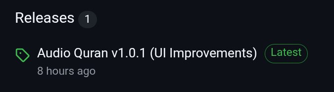
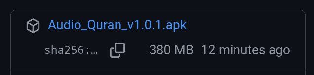

  
  

  <h1 style="color: #2c3e50; line-height: 1.4; margin-bottom: 5px;">
    Audio Quran
  </h1>
  

    Urdu (Translation) Offline Android App
  

  
  
<b>The most accurate, ad-free, and 100% offline Urdu Quran experience.</b>

  

    
    
  

  
  ---
  
  <i>A dedicated Sadaqah Jariyah for the Global Ummah. Built with love for Pakistan, India, Bangladesh, and beyond.</i>

## 🌟 Key Features

<table width="100%">
  <tr>
    <td width="50%">🚫 <b>100% Ad-Free</b> No banners or interruptions. Purely for the sake of Allah.</td>
    <td width="50%">📶 <b>Fully Offline</b> No internet required after installation. 379MB of high-quality local audio.</td>
  </tr>
  <tr>
    <td width="50%">🎯 <b>Authentic Translation</b> Features recognized Urdu translations from classical scholars.</td>
    <td width="50%">🔒 <b>Privacy Focused</b> No tracking, no accounts, and no data collection.</td>
  </tr>
  <tr>
    <td width="50%">📱 <b>Premium UI</b> Modern dark-theme navigation optimized for focus.</td>
    <td width="50%">🎧 <b>High Fidelity</b> Crystal clear MP3 integration for easy understanding.</td>
  </tr>
</table>

## 📸 Interface Preview

  
  
  

## 📥 Installation Guide

1.  **Visit Releases:** Go to the [Latest Release](https://github.com/saaadikur/Audio-Quran-Urdu-Offline/releases/tag/v1.0.1) page.
---

  
<i>Visual guide for Latest Release </i>
 
  

---
2.  **Download APK:** Select `Audio_Quran_v1.0.1.apk` (about 379MB).

  
<i>Visual guide for apk file</i>
 
  

3.  **Install:** Open the file on your Android device. 
    * *Note: You may need to enable "Install from Unknown Sources" in your settings.*

> [!IMPORTANT]
> The file size is large because it contains the **complete** Quranic audio. Once installed, you will never need an internet connection to listen.

## 🛠 Tech Stack

- **Language:** Kotlin (Android)
- **mini OS version:** Android 9.0 (Pie)
- **Architecture:** Modern UI/UX Design
- **Storage:** Local MP3 Asset Integration

---

## 🙏 A Humble Request

This project is developed with sincerity. If you find value in this app, please:
1. Keep the developer in your **sincere Duas**.
2. **Star this repository** to help others find it.
3. Share the link with friends and family.

> "The best of people are those that are most useful to people." — Prophet Muhammad (ﷺ)

  Built for the sake of Allah. Version 1.0.1 (2026)

