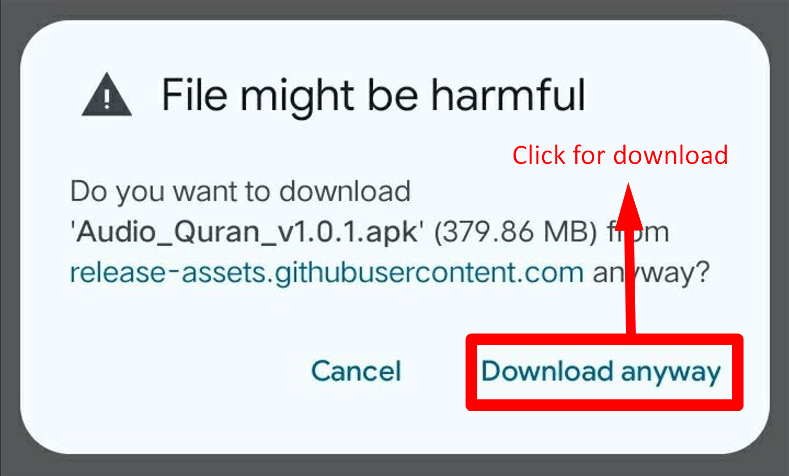

  
  

  <h1 style="color: #2c3e50; line-height: 1.4; margin-bottom: 5px;">
    Audio Quran
  </h1>
  

    Urdu (Translation) Offline Android App
  

  
  
<b>The most accurate, ad-free, and 100% offline Urdu Quran experience.</b>

  

    
    
  

  
  ---
  
  <i>A dedicated Sadaqah Jariyah for the Global Ummah. Built with love for Pakistan, India, Bangladesh, and beyond.</i>

## 🌟 Key Features

<table width="100%">
  <tr>
    <td width="50%">🚫 <b>100% Ad-Free</b> No banners or interruptions. Purely for the sake of Allah.</td>
    <td width="50%">📶 <b>Fully Offline</b> No internet required after installation. 379MB of high-quality local audio.</td>
  </tr>
  <tr>
    <td width="50%">🎯 <b>Authentic Translation</b> Features recognized Urdu translations from classical scholars.</td>
    <td width="50%">🔒 <b>Privacy Focused</b> No tracking, no accounts, and no data collection.</td>
  </tr>
  <tr>
    <td width="50%">📱 <b>Premium UI</b> Modern dark-theme navigation optimized for focus.</td>
    <td width="50%">🎧 <b>High Fidelity</b> Crystal clear MP3 integration for easy understanding.</td>
  </tr>
</table>

## 📸 Interface Preview

  
  
  

# 📖 Audio Quran Urdu Offline
**Pure Urdu Translation • Fully Offline • Ad-Free**

<i>Click the green button above to start your download immediately.</i>

---

---

## 📥 ইনস্টলেশন গাইড (Bangla Guide)

### ১. ডাউনলোড শুরু করুন
উপরে থাকা সবুজ **DOWNLOAD** বাটনে ক্লিক করুন। 

### ২. পারমিশন বা অনুমতি দিন (সবচেয়ে গুরুত্বপূর্ণ)
ডাউনলোড করার সময় আপনার ফোন আপনার কাছে **Permission** বা অনুমতি চাইতে পারে। যদি নিচের ছবির মতো **"File might be harmful"** লেখা আসে, তবে ভয়ের কিছু নেই। এটি একটি সাধারণ অ্যান্ড্রয়েড মেসেজ। 

**কি করবেন:** নিচের ছবিতে দেখানো লাল বক্সের মতো **"Download anyway"** বাটনে ক্লিক করুন।

  

### ৩. ইনস্টল সম্পন্ন করুন
ডাউনলোড শেষ হলে ফাইলটি ওপেন করে **Install** বাটনে ক্লিক করুন। (প্রয়োজন হলে ফোনের সেটিংসে গিয়ে "Unknown Sources" অপশনটি চালু করে দিন)।

---

## 📥 Installation Guide (English Guide)

### 1. Start Download
Click the green **DOWNLOAD** button at the top.

### 2. Grant Permission (Most Important)
While downloading, your phone will ask for **Permission**. If you see the **"File might be harmful"** warning, do not worry—this is a standard message for apps not on the Play Store.

**What to do:** Click on **"Download anyway"** as shown in the red box below to grant permission.

   

### 3. Complete Installation
Once the download is finished, open the file and click **Install**. (If asked, enable "Unknown Sources" in your device settings).

  
<b>Verify File Details:</b>

  

---
> [!IMPORTANT]
> The file size is large because it contains the **complete** Quranic audio. Once installed, you will never need an internet connection to listen.

## 🛠 Tech Stack

- **Language:** Kotlin (Android)
- **mini OS version:** Android 9.0 (Pie)
- **Architecture:** Modern UI/UX Design
- **Storage:** Local MP3 Asset Integration

---

## 🙏 A Humble Request

This project is developed with sincerity. If you find value in this app, please:
1. Keep the developer in your **sincere Duas**.
2. **Star this repository** to help others find it.
3. Share the link with friends and family.

> "The best of people are those that are most useful to people." — Prophet Muhammad (ﷺ)

  Built for the sake of Allah. Version 1.0.1 (2026)

